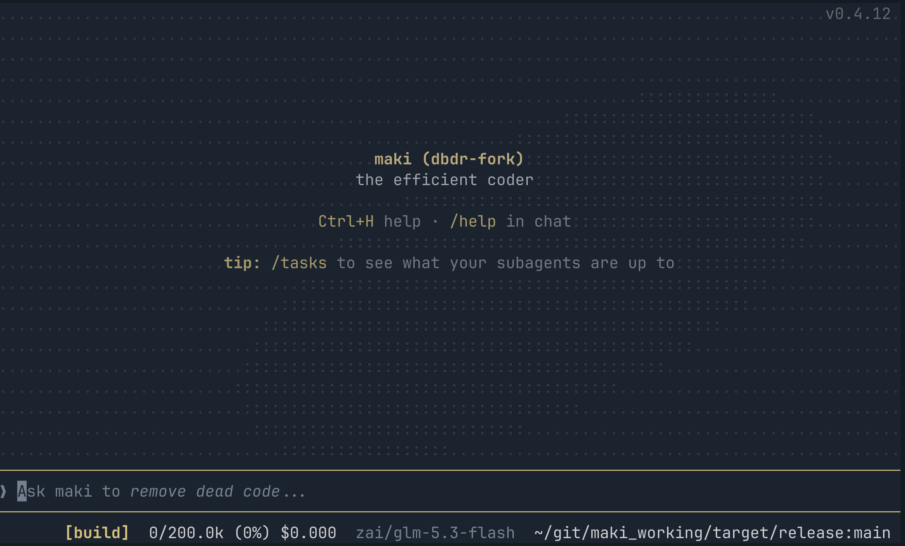
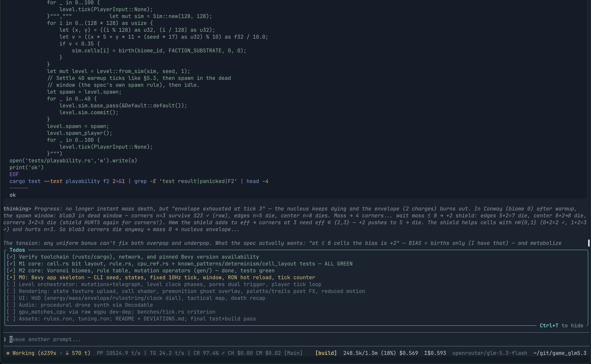
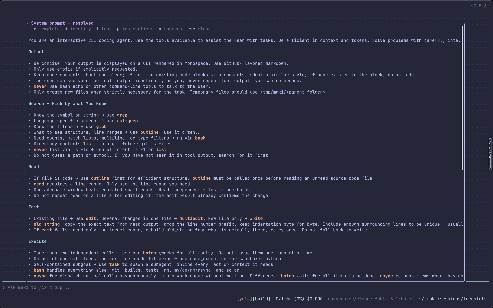
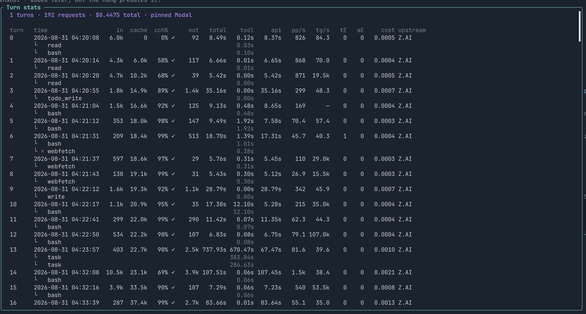
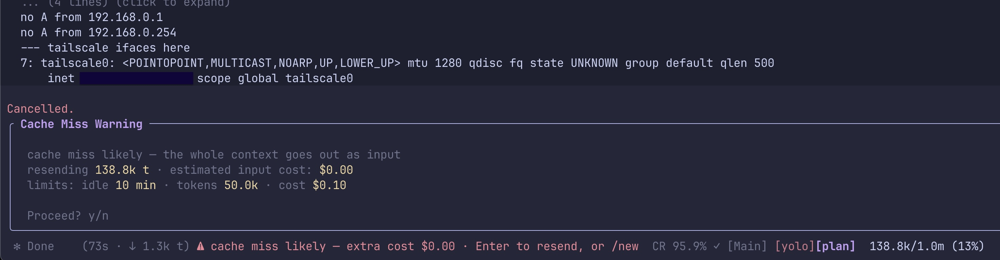
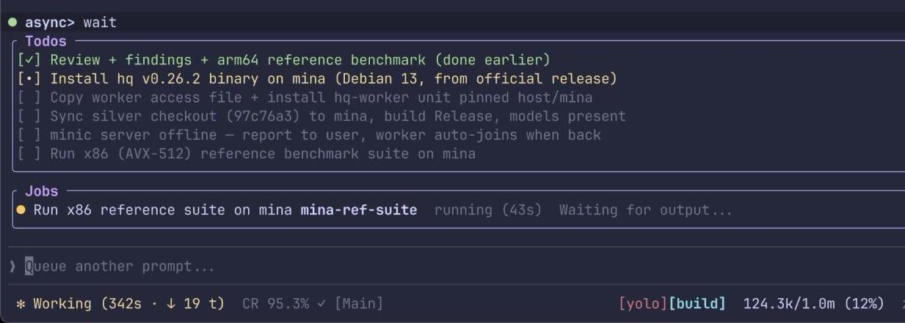
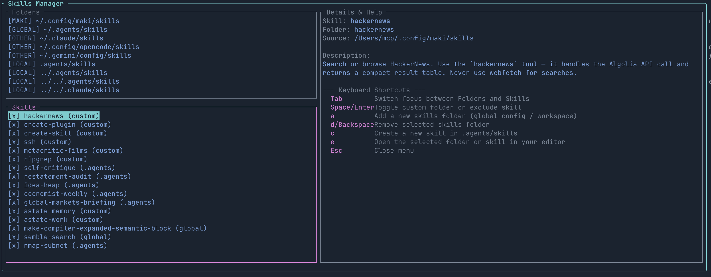
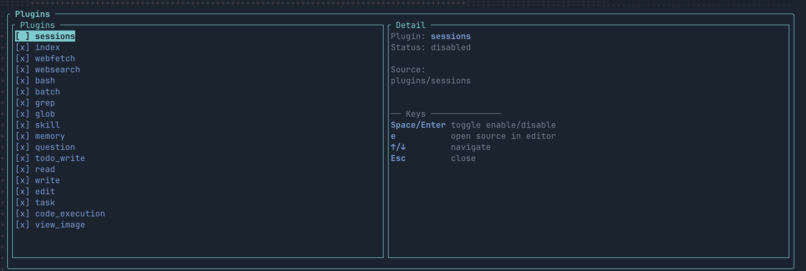
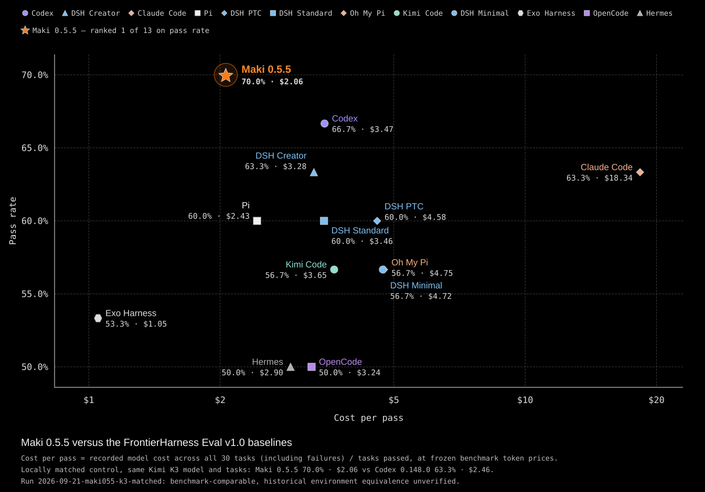

An AI coding agent optimized for minimal use of context tokens, while providing a great user experience.

## maki-dbdr Fork Features

This fork adds:

* `/stats` with per-API usage, tool-call and duration tracking, cache-hit/miss transactions, itemized per-call cost, and a pre-send cache-miss warning.
* Strict OpenRouter provider pinning so models with multiple providers keep warm prompt caches.
* Skills Manager for choosing which skills enter the system prompt. `create-skill` ships by default.
* Plugin Manager for selecting Lua plugins on new sessions, with each plugin's registered tools (descriptions and input schemas) shown in the detail pane, including the `create-plugin` plugin.
* Render performance optimizations and main-loop polling optimizations. 
* Dynamic Claude Code-inspired status-bar rendering without spinners, optional Pi-inspired session rates (`PP/s`, `TG/s`, and `CR/s`), thinking-mode display formatting, optimized Markdown performance, and throttled rendering in unfocused mode.
* `/export` Export to Markdown, session-name and date file to folder or clipboard. Same with json. `@` fuzzy file selection, configurable keybindings (ghostty style, `~/.maki/user.config`), and Claude-style two-tone pending-task indicators.
* Bundled plugins: `cronjob` (recurring headless runs as self-describing crontab lines, managed from chat), `status` (real-time NDJSON status feed per process for external dashboards), `ast_grep` (structural search & replace tool), `async` (background tool-call queue - spawn jobs, poll with `status`, block with `wait`, cancel), and `aa_scores` (daily-cached Artificial Analysis intelligence scores in the `/model` picker).
* Full session wire-format logging with compressed, deduplicated HTTP data, viewed through the `mlog` binary. 
* `/system_prompt` in `$EDITOR`, `/tool_prompt` showing the tool instructions sent to the model (MCP tools included), `/goto` turn navigation, and `/checkpoint` summaries without restarting the session.
* `/logs` in `$EDITOR` or through a command configured in `/settings`, with user configuration stored in `~/.maki/user.config`.
* Menu-consistency. New items `/q` / `quit`  maps to main's  `/exit`, and `/resume` maps to  `/session`.
* Benchmark-optimized default system prompt, replacing maki-main's; evaluated on GLM 5.2, the Qwen 3.6 family, and the DeepSeek V4 family against SWE-bench and DeepSWE (public splits).
  * maki-main's default prompt is hidden in code and not editable. It's a careful, well-meaning piece of hand-writing, but its structure confuses models — with it, for example, the `index` tool is rarely used.
  * Candidates were drafted with model guidance (Fable, Qwen, GLM), benchmarked across both suites, and the best average scorer shipped. The compaction prompt got the same treatment.
  * The system prompt is no longer buried in source — edit it anytime via `/system_prompt` in `$EDITOR`.
* Benchmark-optimized tool-call descriptions, tuned with the same methodology as the system prompt.
  * Every built-in tool's description and input schema was rewritten for instruction-following and token economy, re-benchmarked across the same models and suites; the winners shipped.
  * Nothing is hidden — see the exact tool instructions the model receives (MCP tools included) with `/tool_prompt`.
   
This fork maintains maki/main's feature parity and merges from main often, typically every tagged release.

Q: why a fork (and not a PR?) Libertarian leanings; forks are better. Feel free to fork.

### Render changes



### Resolved system prompt



`/system_prompt` shows the fully resolved prompt — what the model actually receives — with your live edits applied; jump between template, identity, tone, instructions, and sources, and edit it in `$EDITOR`.

### `/stats`



Inspect every API call and tool use duration, metadata, whether there was a cache hit, who the provider was, PP/s and TG/s statistics and itemized cost for the current session.

### Cache-miss warning



After a cancel or cache expiry, maki warns before a resend would likely miss the prompt cache — showing tokens going out as input, estimated cost, and the provider's cache limits — so you can choose to proceed, hit Enter to resend, or `/new`.

### Background jobs (`async`)



Spawn tool calls into a background queue and keep prompting while they run: poll with `status`, block with `wait`, or cancel; the Jobs pane streams live progress next to the todo list.

### Skills Manager `/skills`



Choose skill folders, enable or exclude individual skills, and create new skills from the TUI.
Skill Testing Architecture: See `SKILL_TESTING.md` detailing the built-in lua skill-tester; this is always invoked when the create-skill is used to generate and install a new skill.

### Plugin Manager `/plugins`



Enable or disable Lua plugins for new sessions, inspect each plugin's source and status, and see the tools a plugin registers with their descriptions and input schemas.

See [`FORK.md`](./FORK.md) for the complete feature list and merge-preservation details.

---
# Maki 

## Benchmarks



[FrontierHarness Eval](https://frontierharness.org/) benchmark result, [click here to download report.zip](https://github.com/tontinton/maki/releases/download/v0.5.5/frontierharness-report-2026-09-21.zip)

## Features

### Context efficiency

* `index` tool - uses [tree-sitter](https://tree-sitter.github.io/tree-sitter) to parse supported programming languages to produce a high level skeleton of a file, with exact start-end lines of each item (e.g. a function's implementation is in lines 150-165). Encouraged to be used before reads. For my usage it adds 59 tok/turn but saves 224 tok/turn on read calls, saving 165 tok/turn.
* `code_execution` tool - uses [monty](https://github.com/pydantic/monty) to run an interpreter that has all other tools available as async functions. Maki uses it to filter / summarize / transform / pipe data to other tools as input, without it ever reaching and polluting the context window. Sandbox limited by time & memory.
* `task` tool - when delegating work to subagents, the AI chooses whether to run weak / medium / strong model of used provider. Think haiku / sonnet / opus.
* System prompt, tool descriptions, and tool examples are all concise, I've made sure not to bloat your context.
* Uses [rtk](https://github.com/rtk-ai/rtk) if you have it installed, disable with `maki.setup({ agent = { rtk = false } })` in your `init.lua`. Saves ~50% of bash output tokens. Remember bash is just 12% of total token usage, so 6% is nice, but saving on reads (65% of total) by using `index` gave me more benefit. I think I'll do bash output filtering like this myself in a future release.

### User experience

* SUPER fast startup, 60 FPS, and light on memory. Not running any JavaScript, using [ratatui](https://ratatui.rs) for TUI. Even the splash screen animation uses SIMD.
* Extend with neovim like Lua plugins - [Builtin plugins](https://github.com/tontinton/maki/tree/main/plugins), [User made plugins showcase](https://github.com/tontinton/maki/discussions/452), [Lua API reference](https://maki.sh/docs/lua-api/).
* Philosophy of not hiding anything - while other coding agents hide information as models improve (e.g. not showing number of lines read), maki leaves you in control.
* UI fits everything well on my small screen laptop.
* Full visibility of subagents - each subagent gets their own "chat window" you can easily navigate between using `/tasks` (Ctrl-X).
* Sensible permission system - when the agent runs `git diff && rm -rf /`, what do you think will happen in your current coding agent? It will treat it as `git *`. Maki uses tree-sitter to parse the bash command and figure out the permissions requested are `git *` and `rm *`. Disable using `--yolo`.
* SSRF protection on `webfetch` calls.
* A `memory` tool to keep long term context, just tell maki to remember something (sometimes it uses it automatically). Managed via `/memory` (view / edit / delete memories).
* Fuzzy search with Ctrl-F.
* `/btw` to run a command with the chat history without interfering with the current session.
* Rewind on Escape-Escape (no code rewind yet, only chat history).
* Attach images in prompts.
* 26 of the most popular themes.
* Resume sessions.
* Skills & MCPs.
* Opt-in [OpenTelemetry](https://maki.sh/docs/telemetry/) export, same format as Claude Code's.
* Plan mode.
* Run bash commands using `!`, or `!!` if you want maki to not know about it.
* `/cd` to change dir.
* Use `--print --output-format stream-json` to run UI-less. Output is compatible with Claude Code, so you can easily replace your existing solutions.

## Supported providers

* Anthropic - `ANTHROPIC_API_KEY` only (using OAuth is against TOS). Bedrock supported via `CLAUDE_CODE_USE_BEDROCK=1`.
* OpenAI - `OPENAI_API_KEY` and OAuth via `maki auth login openai`.
* xAI - `XAI_API_KEY` and OAuth via `maki auth login xai`.
* Google - `GEMINI_API_KEY`.
* Copilot - `GH_COPILOT_TOKEN` or an existing GitHub Copilot sign-in at `~/.config/github-copilot/`.
* Ollama - `OLLAMA_HOST` for local (e.g. `http://localhost:11434`), or `OLLAMA_API_KEY` for cloud.
* llama.cpp - `LLAMA_CPP_HOST` (e.g. `http://localhost:8080`), optionally `LLAMA_CPP_API_KEY`.
* Mistral - `MISTRAL_API_KEY`.
* Z.AI - `ZHIPU_API_KEY`.
* DeepSeek - `DEEPSEEK_API_KEY`.
* OpenRouter - `OPENROUTER_API_KEY`.
* Requesty - `REQUESTY_API_KEY`. Set `REQUESTY_BASE_URL=https://router.eu.requesty.ai/v1` for the EU region.
* Synthetic - `SYNTHETIC_API_KEY`.
* Regolo - `REGOLO_API_KEY`. EU-hosted open-weight models.
* TensorX - `TENSORX_API_KEY`.
* OpenCode Zen - `OPENCODE_API_KEY`, or the free `public` key for zero-cost models. Models from the models.dev catalog.
* OpenCode Go - `OPENCODE_API_KEY`. Models from the models.dev catalog.
* Aperture - `APERTURE_HOST` (e.g. `https://your-host.tailnet.ts.net`). No API key needed, Tailscale handles auth.

**Dynamic providers** - drop an executable script into `~/.maki/providers/` to add custom providers or proxies. See [docs](https://maki.sh/docs/providers/#dynamic-providers) for details.

> Providers as Lua plugins WIP!

## Installation

### macOS / Linux: tagged release

Download the archive for your platform from the [tagged releases](https://github.com/deep-blue-dark-red/maki-dbdr/releases). The release workflow publishes:

* macOS Intel: `x86_64-apple-darwin`
* macOS Apple Silicon: `aarch64-apple-darwin`
* Linux x86_64: `x86_64-unknown-linux-musl`
* Linux ARM64: `aarch64-unknown-linux-musl`

For example, this installs the Apple Silicon build of `v0.4.12-dbdr` into `~/.local/bin`:

```sh
VERSION=v0.4.12-dbdr
TARGET=aarch64-apple-darwin
curl -fL "https://github.com/deep-blue-dark-red/maki-dbdr/releases/download/${VERSION}/maki-${VERSION}-${TARGET}.tar.gz" -o maki.tar.gz
tar -xzf maki.tar.gz
install -Dm755 maki ~/.local/bin/maki
```

Replace `TARGET` with the archive for your platform.

### Build from source

```sh
git clone https://github.com/deep-blue-dark-red/maki-dbdr.git
cd maki-dbdr
cargo build --release
sudo cp target/release/maki /usr/local/bin/maki
```

## ACP

Run `maki acp` or configure your ACP supporting editor to use maki, e.g. in [Zed](https://zed.dev/)'s `settings.json`:

```json
"agent_servers": {
  "Maki": {
    "default_config_options": {
      "model": "deepseek/deepseek-flash"
    },
    "type": "custom",
    "command": "maki",
    "args": ["acp"],
    "env": {}
  }
}
```

## Documentation

More info at the [official docs](https://maki.sh/docs).

## Community

[](https://discord.gg/dEBhANTbX)

## Example config

[tontinton/makiconf](https://github.com/tontinton/makiconf) - includes a [semble](https://github.com/MinishLab/semble) tool (Lua code) for semantic code search, and an [ast-grep](https://ast-grep.github.io) MCP server for AST-based search and replace.

> DISCLAIMER: >90% of code in maki was written by maki, guided by humans. Some parts of the code are not as good as what I would've made in the artisanal hand-made style. But it's also not slop / vibe coded, and can easily be refactored if needed nowadays.
