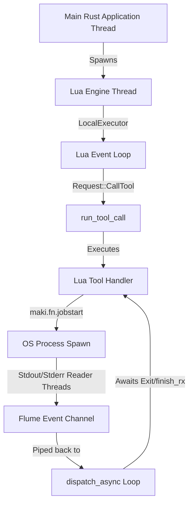
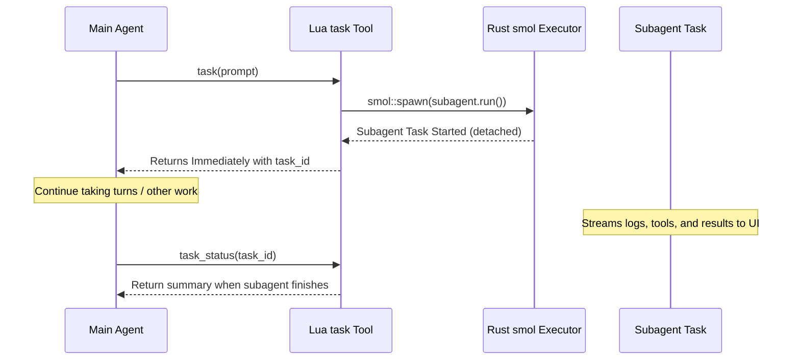

# Maki Threading, Async Tool Execution, and Subagent Routing Architecture

This document provides a detailed analysis of Maki's threading model, examines
the execution flow for shell commands and subagents, and outlines a concrete,
non-disruptive implementation plan for introducing managed background tasks,
asynchronous subagents, and multi-model routing.

---

## 1. Threading Model and Command/Tool Execution

Maki is built on top of the **`smol`** asynchronous runtime in Rust. However,
because Lua VMs (specifically `mlua` / Luau) are not thread-safe, the entire Lua
runtime is isolated to a single thread driven by a cooperative
**`LocalExecutor`**.



### Current Command Execution Flow

When the LLM invokes the `bash` tool (implemented in
[plugins/bash/init.lua](file:///Users/mcp/git/maki/plugins/bash/init.lua)), the
following happens:

1. **Spawn**: `maki.fn.jobstart(command, callbacks)` is called. This delegates
   to `JobStore::start` in
   [fn.rs](file:///Users/mcp/git/maki/maki-lua/src/api/fn.rs).
2. **Reader Threads**: Maki spawns three standard OS threads (`job-stdout`,
   `job-stderr`, `job-wait`) to read from the command's pipes and send
   `JobEvent`s back via a `flume` channel.
3. **Dispatch & Polling**: The tool handler returns `nil` to indicate
   asynchronous progress. This triggers `dispatch_async` in
   [runtime.rs](file:///Users/mcp/git/maki/maki-lua/src/runtime.rs), which
   enters a polling loop:
   - It drains stdout/stderr lines and runs the associated Lua callback
     functions on the local executor.
   - It yields using `smol::Timer::after(DISPATCH_POLL_INTERVAL).await`.
   - It blocks the tool execution from completing until the command exits (which
     triggers `ctx:finish`).

Because the main agent's Rust step loop does `.await` on the tool invocation
execution, the agent cannot take any further turns or start new actions until
the command finishes.

### Plan: Adding Managed Background Tasks (`ManageTask`)

To support running multiple background tasks concurrently (similar to
`antigravity-cli` or `claude`), we can introduce a background task management
layer:

1. **Interactive vs. Background Decision**:
   - We extend the `bash` tool with an optional `background` parameter.
   - Alternatively, if a command runs longer than a specified timeout (e.g. 5
     seconds), the agent can prompt or automatically detach it.
2. **Task Registration**:
   - We introduce a global `TaskRegistry` in `maki-agent` that keeps track of
     active processes (detached from the blocking `dispatch_async` loop).
   - Each process is assigned a unique human-readable `task_id` (e.g.
     `task-123`).
3. **Expose `manage_task` Tool**:
   - Provide a new built-in plugin tool `/manage_task` with actions:
     - `list`: Shows all running background tasks.
     - `status`: Returns the current tail output and exit status.
     - `send_input`: Directs input bytes to stdin of the task.
     - `kill`: Sends SIGKILL or SIGTERM to the process group.

---

## 2. Asynchronous Subagent Execution

Currently, when the main agent delegates a subgoal to a subagent via the `task`
tool, the tool execution blocks the main agent. This is because
`plugins/task/init.lua` awaits the subagent loop directly:

```lua
local result = maki.agent.run(agent_ctx, { ... }) -- Blocks main agent until subagent is DONE
```

### Implementing Async Subagents Without Codebase Changes

Maki's architecture is already reactive and capable of rendering asynchronous
progress:

- Every subagent is initialized with its own `tool_use_id`.
- The TUI app maintains a list of `Chat` views in `self.chats`. The main chat is
  index 0; any subagent gets a new index dynamically.
- TUI routes incoming async `AgentEvent`s containing
  `envelope.subagent = Some(subagent_info)` to update the corresponding
  subagent's chat stream.

Therefore, we can decouple the main agent loop from the subagent's execution
using **`smol::spawn`**:



### Step-by-Step Execution Flow

1. **Background Spawning**:
   - Introduce `maki.agent.spawn(agent_ctx, opts)` in
     [agent.rs](file:///Users/mcp/git/maki/maki-lua/src/api/agent.rs).
   - This function does
     `smol::spawn(async move { agent.run(input).await }).detach()` and returns a
     `task_id` (string representation of the uuid/tool_use_id).
2. **Immediate Return**:
   - The `/task` tool calls `maki.agent.spawn` and returns
     `"Subagent spawned under task_id: XXX"` immediately to the main LLM.
3. **TUI Stream Routing**:
   - Because `agent.run` is running concurrently in `smol`, the subagent's
     `EventSender` continues sending progress events (`AgentEvent::ToolStart`,
     `AgentEvent::TextDelta`, etc.).
   - The main TUI event handler processes these events on the fly, rendering the
     subagent's progress in its own pane without locking up the main input
     prompt.
4. **Retrieve Results**:
   - Expose a `task_status` tool to the main agent.
   - The main agent calls `task_status(task_id)` to poll progress or retrieve
     the subagent's final summary.

---

## 3. Subagent Model Routing

Maki already has an elegant model resolution and provider instantiation model
that we can leverage for routing.

### Current Architecture

Inside `maki-lua/src/api/agent.rs`, when running a subagent:

```rust
let (model, provider): (Model, Arc<dyn provider::Provider>) = if let Some(ref spec) = model_spec {
    let mut m = Model::from_spec(spec)?;
    let p = provider::from_model_async(&mut m, agent_ctx.timeouts).await?;
    (m, Arc::from(p))
} else {
    (Model::clone(&agent_ctx.model), Arc::clone(&agent_ctx.provider))
};
```

This dynamically:

1. Parses the requested `model_spec` (e.g., `anthropic/claude-3-5-sonnet` or
   `google/gemini-1.5-pro`).
2. Calls `provider::from_model_async` to dynamically construct and authenticate
   the client for the targeted provider kind at runtime.

### Required Changes for Multi-Model Routing

To allow the agent to route queries to arbitrary models or tiers:

1. **Expose Model Spec in `task` schema**:
   - Update `plugins/task/init.lua` schema to allow a `model` property
     (accepting specific model strings like `openai/gpt-4o`,
     `google/gemini-2.0-flash`, etc.) in addition to the standard tier names
     (`weak`, `medium`, `strong`).
2. **Provider Credentials and API Keys**:
   - Ensure the required API keys (e.g. `GEMINI_API_KEY`, `OPENAI_API_KEY`) are
     fetched dynamically from the host environment or system configuration
     during the `provider::from_model_async` call.
   - If an API key is missing for the requested model's provider, fall back
     gracefully to the main agent's provider or raise a descriptive error tool
     output.
3. **Prompt and Token Adjustments**:
   - Since different models have different system instructions and tool schemas
     (e.g. thinking vs non-thinking, XML-based tool call formats vs JSON tool
     calls), ensure that the subagent's prompt assembly templates adjust based
     on the resolved model's features (such as `supports_thinking()`).
